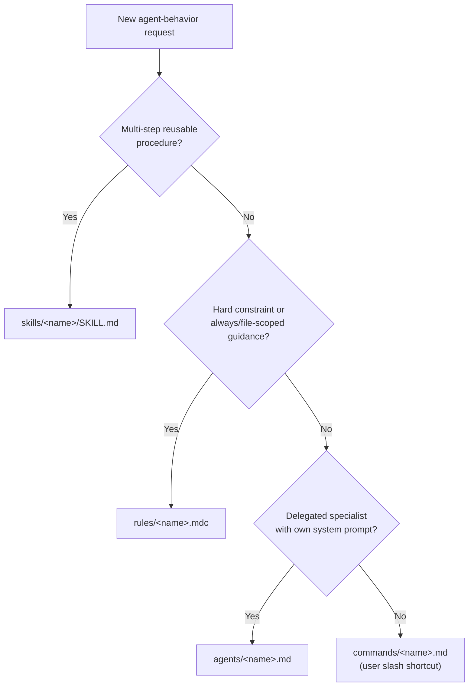

# AGENTS.md — GenSource.Template

Root instructions for any AI coding agent working in this repository.
Cursor loads this file (and project rules/skills/commands/agents) at session start.

## What this project is

`GenSource.Template` is a **Tauri v2 desktop app template**: React +
TypeScript frontend, Rust backend, packaged for Windows via NSIS. It ships a
runnable Nord Polar Night / macOS-style shell (custom titlebar + content) and
a kitchen-sink of official desktop plugins for suite reuse. Keep the layout
below when extending it.

## Tech stack & layout

- **Frontend** — `src/app/` (`App.tsx`, `main.tsx`, `pages/`, `styles/modules/`,
  `types/`), Vite + React 19 + TypeScript + Tailwind v4. UI is flat Nord Polar
  Night with a macOS-like traffic-light titlebar.
- **Config centralization** — all tooling config lives under `src/configs/`
  instead of the repo root: `vite.config.ts`, `vitest.config.ts`,
  `playwright.config.ts`, `eslint.config.js`, `middleware.ts`, and
  a `tsconfig.*.json` split by purpose (`base`/`app`/`build`/`e2e`/`node`/
  `test`). The root `tsconfig.json` references these.
- **Backend** — `src-tauri/src/` (`lib.rs`, `main.rs`, `commands/commands.rs`,
  `state/state.rs`, `mdoels/models.rs` — note the `mdoels` directory name is
  a pre-existing typo in this template; preserve it unless asked to rename,
  since renaming affects `mod` paths across the crate). Tauri v2 permissions
  live in `src-tauri/capabilities/{default,desktop}.json`.
- **Packaging** — Windows-first, via `src-tauri/nsis/installer.nsh` and
  `other/utilities/7zr.exe`.
- **Tooling** — npm (`.node-version`, `.npmrc`), commitlint, release-it,
  prettier, Vitest, Playwright.
- **Environments** — `.env`, `.env.dev`, `.env.local`, `.env.prod`,
  `.env.example` (names only in `.env.example`; never real secrets).
- **TypeScript** — pin the newest 5.x that `typescript-eslint` supports
  (TypeScript 7 may be latest npm but is currently peer-incompatible).

Full path details for skills live in
[`skills/create-skill-pro/references/project-context.md`](skills/create-skill-pro/references/project-context.md).

## The `.cursor/` folder (Cursor-native only)

Use **only** Cursor-native surfaces under `.cursor/`. Do not invent custom
trees (`personas/`, `memory/`, `workflows/`, top-level `scripts/`, or
`.rules.md` / `.command.md` / `.agent.md` naming).

| Path | Purpose |
| --- | --- |
| [`rules/`](rules/) | Project rules as `*.mdc` (`alwaysApply` / `globs`) |
| [`skills/`](skills/) | On-demand Agent Skills (`<name>/SKILL.md`) |
| [`commands/`](commands/) | Slash commands as `*.md` |
| [`agents/`](agents/) | Custom subagents as `*.md` (`name` + `description` frontmatter) |
| [`hooks.json`](hooks.json) + [`hooks/`](hooks/) | Project hooks (Node `.mjs`) |
| [`mcp.json`](mcp.json) | Project MCP server config |
| [`cli.json`](cli.json) | Cursor CLI project overrides |

Also at the repo root: [`.cursorignore`](../.cursorignore) (indexing ignore).

### Which primitive do I create?

### Project subagents

- [`agents/rust-tauri-reviewer.md`](agents/rust-tauri-reviewer.md)
- [`agents/frontend-reviewer.md`](agents/frontend-reviewer.md)
- [`agents/template-debugger.md`](agents/template-debugger.md)
- [`agents/placeholder-implementer.md`](agents/placeholder-implementer.md)

### Project skills (testing)

- [`skills/tester-pro/SKILL.md`](skills/tester-pro/SKILL.md) — run suites first,
  then fill gaps from [`tests/surfaces.json`](../tests/surfaces.json)
  (`/tester-pro` slash command).

### Creating a new skill

Use [`create-skill-pro`](skills/create-skill-pro/SKILL.md). It scaffolds a
spec-compliant `SKILL.md` under `.cursor/skills/<name>/` and grounds paths in
this repo's real layout.

### MCP

[`mcp.json`](mcp.json) starts with an empty `mcpServers` object so clones are
not forced onto unauthenticated servers. To add Context7 (library docs) or
other servers, edit `mcp.json` using Cursor's current project MCP schema
(Settings → MCP), then commit the working config if the team should share it.

### CLI

[`cli.json`](cli.json) holds optional Cursor CLI project overrides merged on
top of `~/.cursor/cli-config.json` for sessions in this repo.

## Learned User Preferences

- Keep agent context Cursor-native under `.cursor/` only; do not reintroduce `.agents/` or invent non-native trees such as `personas/`, `memory/`, or `workflows/`.
- Prefer a flat Nord UI across themes: no gradients, glow, glass, or multi-layer shadows; macOS-like traffic-light titlebar on the left with centered title; keep the titlebar relatively short; traffic lights have no interior glyphs; terminal prompt should be a modern two-line Powerline style that matches Nord themes with readable spacing between successive prompts (without breaking the two-line layout); status-bar metrics and tooltips must stay minimal, beautiful, and Nord-token consistent; packaged splash and early chrome must follow `settings.json` theme (not a hard-coded dark/Polar Night default).
- Keep CSS modular under `src/app/styles/modules/`; treat `index.css` as an import hub only.
- Prefer Terminus as the default UI font; keep bundled Nerd Fonts under `public/fonts/nerdfonts/{firacode,terminus,ubuntu}/` (do not flatten into `public/fonts/`); switch via `settings.json` `fontFamily` (`Terminus`, `Ubuntu`, `Fira Code`, or `Plus Jakarta Sans`).
- Prefer latest stable package versions, but keep TypeScript on the newest 5.x that `typescript-eslint` supports; do not reintroduce knip (dependency, config under `src/configs/`, or package.json script/entries) after it was removed.
- Prefer premium theme-matched explorer file icons over generic sets; switch via `settings.json` `fileIconSet` (`catppuccin` default, `material`, or `nord`; aliases `cat` / `mat` / `nord-native`).
- Do not place the square app icon in the main content UI; reserve icon assets for tray, taskbar, and window only (`public/icons/` sources, bundled into `src-tauri/icons/).
- Do not persist window width or position in `other/configs/settings.json` (geometry writes caused move/flash issues).
- When implementing an attached plan, do not edit the plan file; reuse existing todos and mark them in progress rather than recreating them.
- Titlebar, content, tray, terminal-tab, and file-tree context menus should share the same custom flat, theme-aware styling and overflow outside the app window (popup), not clip inside; keep terminal tabs uncluttered (no close X on tabs — close/rename via tab menu; show the pin icon only while a tab is pinned); hide native overflow arrows/scrollbar chrome and use mousewheel/trackpad horizontal scrolling while the add-tab button stays fixed; Open in Terminal should set the tab cwd without echoing `cd` (About-style modal with Cancel / Open terminal tab when none is open).
- Prefer project-relative paths (e.g. `other/logging/...`) over absolute filesystem paths when referring to files, logs, and project locations.
- Config/settings UI should write through to `other/configs/` while keeping manual edits + watchers working; avoid full UI remount/flash on save when possible, and if a refresh is unavoidable restore the active side-panel tab/state instead of jumping back to Files; Config category sub-pages use distinct icon nav (not the bottom panel tab style); do not show the agent system prompt in Config; Agents uses the same icon-nav pattern (chat + previous chats); agent replies belong in the Agents panel, not the open terminal, unless the user asks for terminal work.

## Learned Workspace Facts

- This repo is `GenSource.Terminal` (product GenSource Terminal, identifier `com.gensource.terminal`, deep-link scheme `terminal`, `appinfo.json` `codename`/`edition`); treat it as its own product, not the template. Canonical agent instructions live in `.cursor/AGENTS.md`; root `AGENTS.md` only points there.
- Runtime app config lives in `other/configs/` (`appinfo.json`, `settings.json`, `keybindings.json`, `logging.json`, `agent.json`) and ships beside the installed `.exe` under `other/`; keep those JSON files comment-free and document options in `other/configs/README.md` (loader still accepts JSONC); Gemini keys stay in Rust/`agent.json` (never the webview) with models Gemini 3.6 Flash, 3.5 Flash, 3.5 Flash-Lite, and 3.1 Pro; the Config side-panel tab edits settings via `save_settings` / `save_logging` / `save_keybindings` (and `get_logging`) while files remain manually editable; `fileIconSet` selects explorer icons (`catppuccin` / `material` / `nord`); `particleEffect` selects the hot-reloaded `dust`, `constellation`, or `orbs` terminal backdrop; `autostart` drives `@tauri-apps/plugin-autostart`; prefer `appinfo.json` visible but read-only when the platform allows.
- Opaque app-managed persistence uses `@tauri-apps/plugin-store` via `src/app/lib/app-store.ts` (AppData `app-state.json`); do not route `other/configs/` through the store; only pinned terminal tabs persist across restarts (custom names + history/scrollback); sanitize pinned scrollback so blank and prompt-only lines are not saved or restored; unpinned tabs are session-only; SCM folder path for Source Control also persists via the store; structured local data (agent chat history and similar) uses `tauri-plugin-sql` SQLite under `other/database/sqlite/` (chats in `other/database/sqlite/agents/chats/`), Stronghold for secrets, and stays portable beside the exe.
- Terminal PTY uses `portable-pty` (Windows ConPTY) with `pty_create`/`pty_write`/`pty_resize`/`pty_kill` and `pty-output`/`pty-exit` events; shell profiles resolve from `settings.json` (frontend sends `profileId`); Open in Terminal uses a one-shot PTY cwd override (folder path, or parent folder for files) instead of typing `cd`; the bundled Nord PowerShell prompt is loaded with process-scoped `-ExecutionPolicy Bypass`/`-NoProfile`, never a machine/user policy change.
- Icon sources live in `public/icons/` (`icon.svg`, `icon.png`, `icon.ico`); tray/taskbar/window icons are the bundled set under `src-tauri/icons/` — regenerate with `npm run tauri -- icon ./public/icons/icon.png` after changing sources (updating `public/icons/` alone does not refresh tray/taskbar).
- Tooling configs stay under `src/configs/`; do not recreate Vite, ESLint, Vitest, or Playwright configs at the repo root.
- Themes are independent Nord palettes (polar-night, snow-storm, frost, aurora) with fixed `*-dark`/`*-light` variants; `system`, `frost`, and `aurora` follow OS light/dark via `settings.json` `theme`.
- Custom context menus cover titlebar, content area, tray, terminal tabs, file-tree entries, and the Source Control tab and should overflow outside the app window via a popup; menu action keybindings live in `other/configs/keybindings.json`; terminal-tab “Close All Tabs” closes unpinned tabs only; exclude ephemeral popup windows (`tray-menu` and overflow context menus) from `tauri-plugin-window-state` so they do not restore/auto-open on launch.
- Terminal workspace chrome: the drag-resizable left side panel (default ~260px; toggle from a thin bottom status bar) has four equal bottom tabs — Files (theme-aware explorer: all drives, `C:\` expanded initially, lazy tree, toolbar, `fileIconSet` icons, Open in Terminal / Open in Git panel / About), Source Control (VS Code-like git via pure-Rust gitoxide/`gix`; open/close repo; empty-state open folder + red Close when a repo is open; `notify` watch `git_watch_start`/`git_watch_stop` + `scm-changed` auto-stages unstaged/untracked, expanding directory paths to files and skipping one pass after Unstage; click a changed file opens a unified git-diff tab beside terminal tabs via `imara-diff`, unchanged / green add / red delete), Agents (BotIcon; Gemini via `rig-core`; chat-first in the panel with confirm-before-terminal-write; icon sub-nav like Config: chat + previous chats), and Config (category sub-pages writing to `other/configs/`); the terminal tab strip starts to the right of the panel; the status bar shows right-aligned CPU/GPU/RAM/network metrics with expanded hover tooltips and a far-right usage↔temperature toggle (temps via LibreHardwareMonitor/`lhm-sys` with NVML/WMI fallbacks; LHM builds need .NET SDK 8 and may prompt for admin); resizing the panel must resize the terminal with it.
- Runtime app logs belong under `other/logging/app/`; build logs under `other/logging/build/` (tee from packaging/build wrappers); log files named `[TIME]_[DATE]_[APPVERSION].log`; user-runnable maintenance bats live in `other/utilities/scripts/` (`archive-logs.bat` via `other/utilities/7zr.exe` → timestamped `.7z` in `scripts/archive/`, plus `clean-logs-app.bat`, `clean-logs-build.bat`, `clean-logs-archive.bat`).
- npm runners live in `src/scripts/` (`dev.js` → Vite `dev`, `log-tauri-app.js` → `tauri:dev` with tee to `other/logging/app/`, `log-tauri-build.js` → `tauri:build` with tee to `other/logging/build/`, `package.js` → `package` / `package:clean`); Windows release packaging targets `release/` with an x64-only NSIS installer (custom hooks in `src-tauri/nsis/installer.nsh`, per-user or system-wide) plus a matching portable zip.
- Tests live under `tests/` (`unit/`, `e2e/` including Playwright visuals); reports/outputs go in `tests/artifacts/`; surface inventory is `tests/surfaces.json` (used by tester-pro).
