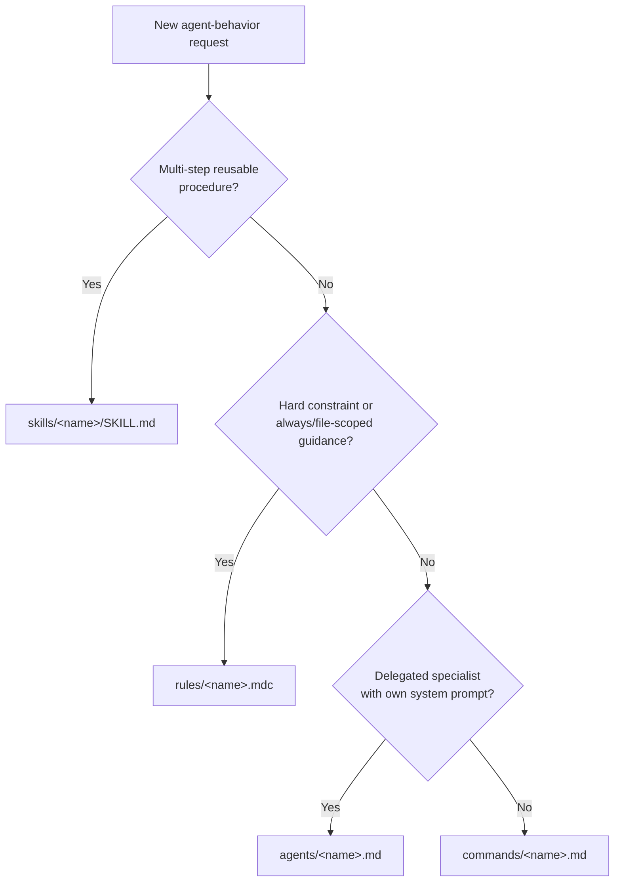

# create-skill-pro

Creates skills that are spec-compliant, appropriately sized, and genuinely
tailored to this repo — not generic boilerplate.

## Workflow

1. **Clarify scope.** Confirm the skill's name (lowercase-hyphenated,
   ≤64 chars), what it does, and when it should trigger. If ambiguous, ask
   before scaffolding.
2. **Check for overlap.** Look in `.cursor/skills/` for an existing skill
   covering this; look in `.cursor/rules/` (`.mdc`), `.cursor/commands/`
   (`.md`), and `.cursor/agents/` (`.md`) for whether this is really a
   different primitive (see [decision guide](#which-cursor-primitive) below).
3. **Scan native `.cursor/` surfaces for material to wire in.** Before
   writing from scratch, check:
   - `rules/` — constraints the skill must obey
   - `commands/` — a slash command that should invoke this skill
   - `agents/` — a subagent that should run part of the workflow
   - `hooks/` / `hooks.json` — automation that might interact with the skill
   - `mcp.json` / `cli.json` — MCP or CLI config the skill should respect
   - sibling skills under `skills/` — overlap or shared references

   Skip anything that adds no value.
4. **Scaffold.** Either run:

   ```bash
   node .cursor/skills/create-skill-pro/scripts/new-skill.mjs <name> \
     --description "What it does. Use when ..." --title "Title Case Name"
   ```

   or copy [`assets/skill-template.md`](assets/skill-template.md) by hand
   to `.cursor/skills/<name>/SKILL.md`.
5. **Write the body.** Keep it under ~500 lines / ~5000 tokens (see
   [progressive disclosure](references/agentskills-spec.md#progressive-disclosure-why-body-length-matters)).
   Ground every file path/convention in
   [`references/project-context.md`](references/project-context.md) — never
   invent project facts. See
   [`examples/tauri-command-skill/`](examples/tauri-command-skill/SKILL.md)
   for calibration, and the real
   [`../add-tauri-command/`](../add-tauri-command/SKILL.md) skill for a
   live counterpart.
6. **Add per-skill subfolders only where they earn their keep** (see
   [subfolder purposes](#per-skill-subfolder-purposes) below). It's fine —
   good, even — for a small skill to have only a `SKILL.md` and nothing else.
7. **Self-review and validate.**

   ```bash
   node .cursor/skills/create-skill-pro/scripts/validate-skill.mjs .cursor/skills/<name>/SKILL.md
   ```

   Also walk [`resources/quality-checklist.md`](resources/quality-checklist.md)
   before considering the skill done.

## Frontmatter quick reference

| Field | Required | Notes |
|---|---|---|
| `name` | Yes | Must match the parent directory name. |
| `description` | Yes | States what + when; include trigger keywords. |
| `license`, `compatibility`, `metadata`, `allowed-tools` | No | See [full spec reference](references/agentskills-spec.md). |

`version` goes in `metadata.version`, not top-level. Full constraints and
the directory-discovery/collision rules live in
[`references/agentskills-spec.md`](references/agentskills-spec.md).

## Per-skill subfolder purposes

Each of the five optional subfolders a skill can have does one distinct job
— use whichever apply, skip the rest:

| Folder | Use for |
|---|---|
| `scripts/` | Executable helpers (validation, scaffolding, codegen). |
| `references/` | Long-form docs loaded on demand (specs, deep dives). |
| `assets/` | Copyable output material (templates/boilerplate). |
| `examples/` | Worked calibration material (sample input/output, sample skills). |
| `resources/` | Curated, non-copyable support material (checklists, external links). |

Shared cross-skill automation belongs in `.cursor/hooks/` (project hooks),
not a top-level `.cursor/scripts/` folder.

## Which Cursor primitive?

Not every request is a skill. See
[`AGENTS.md`](../../AGENTS.md) and this decision guide:



Do **not** create non-native folders (`personas/`, `memory/`, `instructions/`,
top-level `scripts/`, or `.rules.md` / `.command.md` / `.agent.md` naming).
Use Cursor-native rules, skills, commands, and `agents/*.md` only.

## After creation

A skill may reference sibling skills, rules, commands, hooks, or MCP config.
Document any such dependency in the skill body.

Optionally add a matching slash command under `.cursor/commands/<name>.md`
that tells the agent to follow this skill.

## Auditing an existing skill

Run `scripts/validate-skill.mjs` against it, then walk
`resources/quality-checklist.md`. Common fixes: body too long (move detail
to `references/`), stale project references (cross-check against
`references/project-context.md`), or unused empty subfolders left over from
scaffolding.
