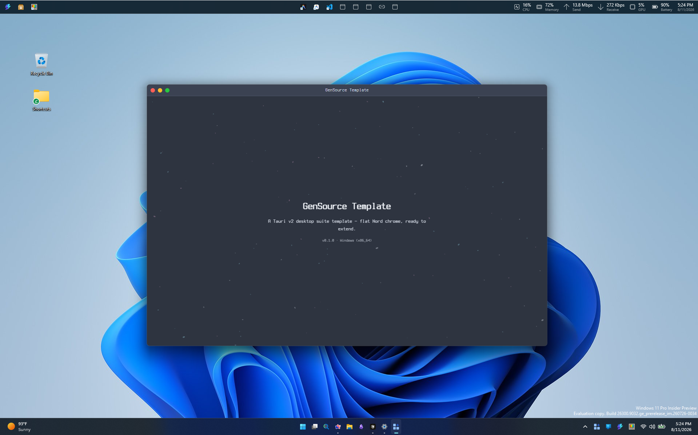

# GenSource.Template

<p align="center">
  <strong>Shared Tauri v2 desktop template for the GenSource suite</strong>
</p>

<p align="center">
  <a href="https://tauri.app/"></a>
  <a href="https://react.dev/"></a>
  <a href="https://www.typescriptlang.org/"></a>
  <a href="https://www.microsoft.com/windows"></a>
</p>

<p align="center">
  
</p>

A runnable starting point for GenSource desktop apps: React + TypeScript frontend, Rust / Tauri v2 backend, Nord Polar Night shell with a macOS-style custom titlebar, and a kitchen-sink of official Tauri plugins ready for suite reuse.

## Features

- Custom titlebar with traffic-light controls and flat Nord theming
- Theme palettes (polar-night, snow-storm, frost, aurora) with light/dark variants
- Official Tauri desktop plugins pre-wired for filesystem, dialogs, store, updater, and more
- Windows-first packaging: NSIS installer and portable zip (x64 only)
- Tooling configs centralized under `src/configs/` (Vite, Vitest, Playwright, ESLint)
- Cursor-native agent rules, skills, and hooks under `.cursor/`

## Quick start

**Prerequisites:** [Node.js 22](https://nodejs.org/) (see `.node-version`), [Rust](https://www.rust-lang.org/tools/install) with Cargo, and the [Tauri Windows prerequisites](https://v2.tauri.app/start/prerequisites/).

```bash
npm install
npm run tauri:dev
```

Frontend only (Vite, no desktop shell):

```bash
npm run dev
```

## Scripts

| Script | Purpose |
| --- | --- |
| `npm run tauri:dev` | Vite + Tauri desktop (logs to `other/logging/app/`) |
| `npm run dev` | Frontend-only Vite dev server |
| `npm run build` | Typecheck + Vite production build |
| `npm run tauri:build` | Windows NSIS bundle (logs to `other/logging/build/`) |
| `npm run package` | Windows x64 NSIS + portable zip under `release/` |
| `npm test` | Vitest unit tests |
| `npm run test:e2e` | Playwright visual + e2e |
| `npm run lint` | ESLint |
| `npm run typecheck` | `tsc -b` |

## Documentation

| Guide | Description |
| --- | --- |
| [Development](other/documents/development.md) | Layout, env files, and test workflows |
| [Features](other/documents/features.md) | UI shell, themes, menus, plugins, and runtime config |
| [Packaging](other/documents/packaging.md) | Windows build, NSIS, and release packaging |
| [Contributing](.github/CONTRIBUTING.md) | Prerequisites, commits, PRs, and community docs |
| [Agent instructions](.cursor/AGENTS.md) | Canonical guidance for AI coding agents |
