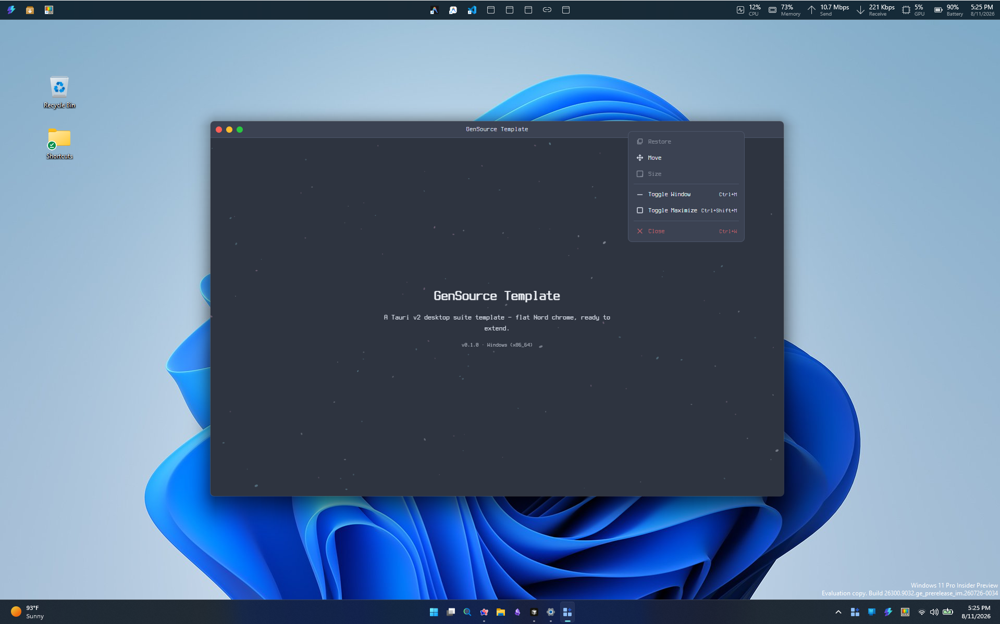
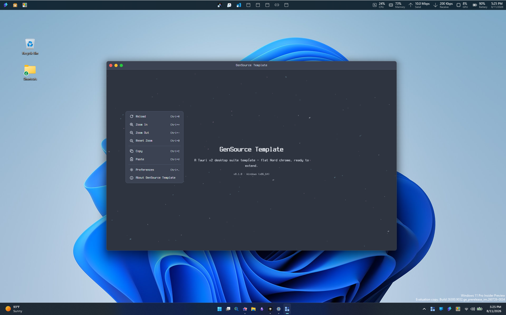

# Features

UI shell, themes, plugins, and runtime configuration in GenSource.Template.

## Shell and themes

The template ships a flat Nord UI with a macOS-style custom titlebar (traffic lights on the left, centered title). Themes are independent Nord palettes with fixed light/dark variants:

- **polar-night** / **snow-storm** — fixed dark / light
- **frost** / **aurora** — follow OS light/dark when selected (along with **system**)

Default UI font is Terminus (bundled Nerd Font). Switch via `other/configs/settings.json` `fontFamily` (`Terminus`, `Ubuntu`, `Fira Code`, or `Plus Jakarta Sans`).

Design posture: flat surfaces, no gradients, glow, glass, or multi-layer shadows.

## Context menus

Custom, theme-aware menus cover the titlebar, content area, and system tray. Menu action keybindings live in `other/configs/keybindings.json`.





## Plugins

The template includes a kitchen-sink of official Tauri v2 desktop plugins so suite apps can opt in without re-scaffolding. Categories include:

- **System** — OS info, process, shell, opener, autostart, global shortcuts, CLI
- **Window** — window state, positioner, tray integration
- **I/O** — filesystem, dialog, clipboard, upload, HTTP, WebSocket
- **Data** — store, SQL (SQLite), Stronghold
- **Lifecycle** — deep link, notification, updater, log

**Default capabilities are intentionally narrow.** Splash and tray-menu only get minimal window/IPC grants (`capabilities/splash.json`, `tray-menu.json`). The main window (`capabilities/default.json`) includes store, clipboard, opener, updater, and scoped FS — but **not** `shell`, `http`, `sql`, `upload`, or `websocket`. Custom IPC is gated by `permissions/app-commands.toml` (`allow-app-commands`).

When a fork needs a dangerous plugin:

1. Keep the plugin registration in `src-tauri/src/lib.rs` / `Cargo.toml` (or remove unused crates to shrink the binary).
2. Add a scoped permission to a **main-only** capability (never splash/tray unless required).
3. Mirror any frontend `@tauri-apps/plugin-*` dependency in root `package.json`.
4. For HTTP, set explicit origin allowlists before shipping.

## Runtime config

Shipped beside the installed executable under `other/configs/`:

| File | Role |
| --- | --- |
| `appinfo.json` | Product name, version, identifier (prefer read-only when the platform allows) |
| `settings.json` | User-editable JSONC — theme, font, and related preferences |
| `keybindings.json` | User-editable JSONC — menu action shortcuts |

Opaque app-managed persistence uses `@tauri-apps/plugin-store` (`src/app/lib/app-store.ts` → AppData `app-state.json`). Do not route `other/configs/` through the store.

## Icons

- **Sources:** `public/icons/` (`icon.svg`, `icon.png`, `icon.ico`)
- **Bundled tray / taskbar / window icons:** `src-tauri/icons/`

After changing sources, regenerate the bundled set:

```bash
npm run tauri -- icon ./public/icons/icon.png
```

Updating `public/icons/` alone does not refresh tray or taskbar icons. Keep the square app icon out of the main content UI; reserve it for tray, taskbar, and window chrome.
